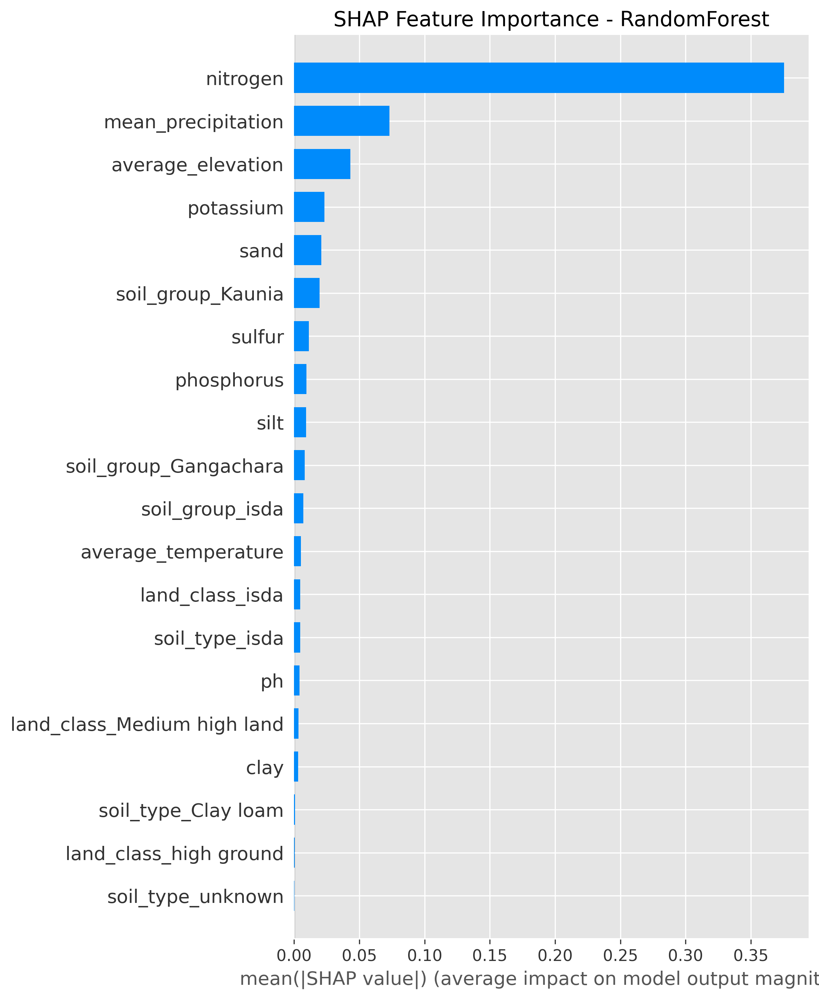
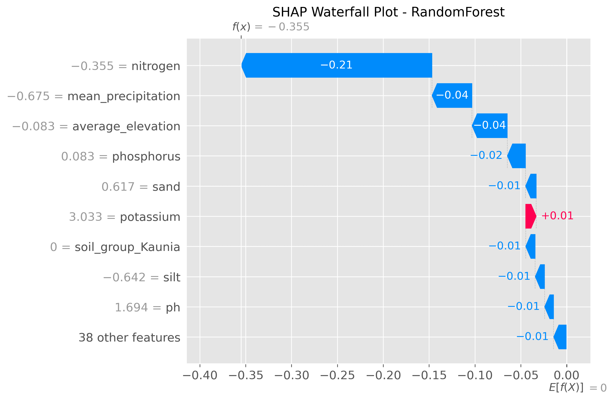
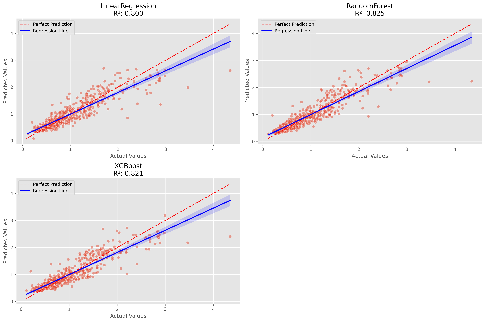

# Soil Organic Carbon (SOC) Prediction API

[](https://www.python.org/downloads/)
[](https://fastapi.tiangolo.com/)
[](https://hub.docker.com/)
[](LICENSE)

A machine learning API for predicting Soil Organic Carbon (SOC) using environmental and soil features. Multiple models were compared and the best performing model (Random Forest) was selected for deployment. The API is built using FastAPI and provides a simple and efficient way to make predictions. 

## Table of Contents
- [Features](#features)
- [Model Performance](#model-performance)
- [Project Structure](#project-structure)
- [Getting Started](#getting-started)
- [Docker Deployment](#docker-deployment)
- [API Documentation](#api-documentation)
- [Model Training](#model-training)
- [Model Insights](#model-insights)
- [Example Usage](#example-usage)
- [Contributing](#contributing)
- [License](#license)

## Features

- **Multiple ML Models**: Random Forest, Linear Regression, and XGBoost algorithms
- **Automated Feature Engineering**: Simple and efficient reprocessing pipeline
- **Model Interpretability**: SHAP value analysis for feature importance
- **REST API**: FastAPI-based prediction service with automatic documentation
- **Docker Support**: Containerized deployment for easy scaling
- **Model Persistence**: Optimized model serialization and loading
- **Performance Monitoring**: Built-in evaluation metrics and visualization tools

## Model Performance

| Model | R² Score | RMSE | MAE | CV RMSE | CV Std. |
|-------|----------|------|-----|---------|---------|
| **Random Forest**  | 0.825433 | 0.254917 | 0.168785 | 0.265363 | 0.015952 |
| XGBoost | 0.821230 | 0.257968 | 0.173745 | 0.267518 | 0.013767 |
| Linear Regression | 0.800036 | 0.272831 | 0.182821 | 0.267765 | 0.015321 |


*⭐ Best model: Random Forest selected based on validation performance*

## Project Structure

```
soc-predictor/
├── app/
│   ├── __init__.py
│   └── main.py              # FastAPI application and endpoints
├── data/
│   └── soil_nutrients.csv   # Training dataset
├── models/
│   ├── preprocessor.pkl     # Trained data preprocessor
│   └── soc_predictor.pkl    # Best performing model (Random Forest)
├── plots/                   # Model performance visualizations
|   ├──**.png
├── utils/
│   ├── data_loader.py       # Data loading utilities
│   ├── evaluator.py         # Model evaluation functions
│   ├── model_persistence.py # Model save/load functions
│   ├── trainer.py           # Model training pipeline
│   └── visualizer.py        # Plotting and visualization tools
├── .gitignore
├── config.py                # Configuration settings
├── Dockerfile               # Container configuration
├── README.md
├── requirements.txt         # Python dependencies
└── train_model.py           # Model training script
```

## Getting Started

### Prerequisites

- Python 3.11 or higher
- pip package manager
- Docker (optional, for containerized deployment)

### Installation

1. **Clone the repository**
   ```bash
   git clone https://github.com/edudzikorku/soc-predictor.git
   cd soc-predictor
   ```

2. **Create a virtual environment** (recommended)
   ```bash
   python -m venv venv
   source venv/bin/activate  # On Windows: venv\Scripts\activate
   ```

3. **Install dependencies**
   ```bash
   pip install -r requirements.txt
   ```

4. **Start the FastAPI application**
   ```bash
   uvicorn app.main:app --reload
   ```

The API will be available at `http://localhost:8000` with interactive documentation at `http://localhost:8000/docs`.

## Docker Deployment

### Build and Run Locally

```bash
# Build the Docker image
docker build -t soc-predictor .

# Run the container
docker run -p 8000:8000 soc-predictor
```

### Pull from Docker Hub

```bash
# Pull the pre-built image
docker pull edudzi/soc-predictor:v1.0

# Run the container
docker run -p 8000:8000 edudzi/soc-predictor:v1.0
```

### Docker Compose (Optional)

```yaml
version: '3.11'
services:
  soc-predictor:
    image: edudzi/soc-predictor:latest
    ports:
      - "8000:8000"
    environment:
      - ENV=production
```

## API Documentation

### Endpoints

#### `POST /predict`
Predicts Soil Organic Carbon based on input features.

**Request Body:**
```json
{
  "average_elevation": 436,
  "average_temperature": 29.87453613,
  "clay": 19,
  "land_class": "isda",
  "mean_precipitation": 7.909778506,
  "nitrogen": 0.0485999,
  "phosphorus": 12.9047,
  "potassium": 0.321371795,
  "sand": 62,
  "silt": 18,
  "soil_group": "isda",
  "soil_type": "isda",
  "sulfur": 8.66247,
  "zinc": 1.72509,
  "ph": 6.10277
}
```

**Response:**
```json
{
  "predicted_soc": 0.7361968417456046,
  "interpretation": "Low SOC level, consider improving soil management practices."
}
```

#### `GET /health`
Health check endpoint for monitoring service status.

#### `GET /model/info`
Returns information about the current model and its performance metrics.

### Interactive Documentation

Visit `http://localhost:8000/docs` for the auto-generated Swagger UI documentation, or `http://localhost:8000/redoc` for ReDoc-style documentation.

## Model Training

To retrain the model with new data or different parameters:

```bash
python train_model.py
```

This script will:
- Load and preprocess the training data
- Train multiple models (Random Forest, Linear Regression, XGBoost)
- Evaluate model performance using cross-validation
- Select the best performing model
- Save the trained model and preprocessor
- Generate performance visualization plots

### Training Configuration

Modify `config.py` to adjust training parameters:
- Model hyperparameters
- Cross-validation settings
- Feature selection options
- Output directories

## Model Insights

### Feature Importance


*The most influential features for SOC prediction, showing nitrogen and mean_precipitation.*

### SHAP Analysis


*SHAP values revealing how each feature contributes to individual predictions.*

### Model Performance Comparison


*Cross-validation performance across different algorithms.*


## Example Usage

### Using Python requests

```python
import requests
import json

# API endpoint
url = "http://localhost:8000/predict"

# Sample soil data
data = {
    "average_elevation": 1000,
    "average_temperature": 20.5,
    "clay": 30,
    "land_class": "isda",
    "mean_precipitation": 800.0,
    "nitrogen": 0.1,
    "phosphorus": 0.05,
    "potassium": 0.2,
    "sand": 40,
    "silt": 30,
    "soil_group": "isda",
    "soil_type": "isda",
    "sulfur": 0.02,
    "zinc": 0.01,
    "ph": 6.5
}

# Make prediction request
response = requests.post(url, json = data)
result = response.json()

print(f"Predicted SOC: {result['soc_prediction']:.2f}")
print(f"Model Confidence: {result['model_confidence']:.2f}")
```

### Using curl

```bash
curl -X POST "http://localhost:8000/predict" \
     -H "Content-Type: application/json" \
     -d '{
       "average_elevation": 1000,
       "average_temperature": 20.5,
       "clay": 30,
       "land_class": "isda",
       "mean_precipitation": 800.0,
       "nitrogen": 0.1,
       "phosphorus": 0.05,
       "potassium": 0.2,
       "sand": 40,
       "silt": 30,
       "soil_group": "isda",
       "soil_type": "isda",
       "sulfur": 0.02,
       "zinc": 0.01,
       "ph": 6.5
     }'
```

## Input Features

| Feature | Description | Unit | Range |
|---------|-------------|------|-------|
| average_elevation | Mean elevation of the area | meters | 0-8000 |
| average_temperature | Mean annual temperature | °C | -10-40 |
| clay | Clay content percentage | % | 0-100 |
| land_class | Land classification type | categorical | - |
| mean_precipitation | Annual precipitation | mm | 0-4000 |
| nitrogen | Nitrogen content | % | 0-1 |
| phosphorus | Phosphorus content | % | 0-1 |
| potassium | Potassium content | % | 0-1 |
| sand | Sand content percentage | % | 0-100 |
| silt | Silt content percentage | % | 0-100 |
| soil_group | Soil group classification | categorical | - |
| soil_type | Specific soil type | categorical | - |
| sulfur | Sulfur content | % | 0-1 |
| zinc | Zinc content | % | 0-1 |
| ph | Soil pH level | - | 3-10 |

## Troubleshooting

### Common Issues

**1. Import errors when starting the application**
```bash
# Ensure all dependencies are installed
pip install -r requirements.txt --upgrade
```

**2. Model file not found**
```bash
# Retrain the model
python train_model.py
```

**3. Port already in use**
```bash
# Use a different port
uvicorn app.main:app --port 8001
```

**4. Docker build issues**
```bash
# Clean build without cache
docker build --no-cache -t soc-predictor .
```

## Contributing

1. Fork the repository
2. Create a feature branch (`git checkout -b feature/amazing-feature`)
3. Commit your changes (`git commit -m 'Add amazing feature'`)
4. Push to the branch (`git push origin feature/amazing-feature`)
5. Open a Pull Request


## License

This project is licensed under the MIT License - see the [LICENSE](LICENSE) file for details.

## Citation

If you use this project in your research, please cite:

```bibtex
@software{soc_predictor,
  title = {Soil Organic Carbon Prediction API},
  author = {Edudzi K. Akpakli},
  year = {2025},
  url = {https://github.com/edudzikorku/soc-predictor.git}
}
```

## Acknowledgments

- Dataset provided by [iPAGE](https://ipageglobal.com/)
- Built with [FastAPI](https://fastapi.tiangolo.com/)
- Machine learning powered by [scikit-learn](https://scikit-learn.org/) and [XGBoost](https://xgboost.readthedocs.io/)
- Model interpretability via [SHAP](https://shap.readthedocs.io/)
- API development and deployment guidance from [Machine Learning Mastery](https://machinelearningmastery.com/step-by-step-guide-to-deploying-machine-learning-models-with-fastapi-and-docker/)

---

**Contact**: kedudzi007@gmail.com 